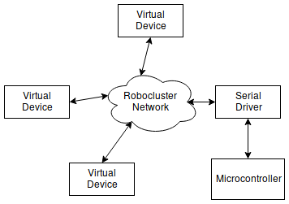

Introduction
============

What is Robocluster?
--------------------
Robolcuster is a framework for creating software for
robotics in which modules can be distributed across multiple
devices. The goal is to make it as easy as possible for processes
to talk to each other, allowing for highly modular software for robotics.
This documentation focuses on the Python implementation of Robocluster,
though implementations in other languages are certainly possible.
Robocluster is primarily a communication library, but also provides some simple
task management features, such as calling functions at regular intervals.

.. note::

    Robocluster is still very much in development, and while we will try to keep
    most of the functionality and wire protocols backwards compatible, the internals
    of the Python implementation and features of Robocluster may change significantly
    over the next months.

Robocluster centers around the concept of virtual devices, which are just things
that perform tasks and interact with other virtual devices on the robocluster network.
Throughout this documentation, you may also see the term "driver" which refers to the same
thing as a virtual device, but usually is dedicated to translating between the robocluster
network and another medium such as USB serial, or a particular device such as a GPS unit.

Robocluster's primary mechanism for communication is UDP/IP and the bulk of the library
is just a wrapper for conventional socket programming. When we refer to the
"Robocluster network", it is just refers to any virtual devices using the Robocluster library
to talk over the local area network.

    A simplification of the roboluster network.

What can Robocluster do?
------------------------
Here is a list of some of the things you can do with Robocluster:

- Run a task at regular intervals (every second, 100ms, 2 minutes, etc).
- Broadcast or publish messages to the network.
- Subscribe to a broadcasted message and call a function when that message is published.
- Send data directly to another virtual device on the network.
- Request data from another virtual device on the network.
- Serial USB devices can participate in the network.

In robotics software, you frequently need some task to be ran periodically,
so Robocluster provides a method to schedule tasks at regular intervals.
Inside these tasks, you can do what ever, talk to other devices on the network,
perform calculations, etc.

.. note:: TODO: what happens if the task takes longer to run that the interval?

Many services you write will provide data or events for any other components to use.
The publish method broadcasts data over the network to no-one in particular.
This is useful when multiple components need to react to the same event,
or if you want to be able to change the receiver without having to change the publisher.

Services can subscribe to a message, which means they register a task to be called
whenever someone else publishes a particular message of interest.

If you want to send data directly to a single device without broadcasting
it to everyone, you can do that as well.

If you know another device has data or can perform a function that you need,
you can send a request to that device, and it will respond with the result.
This can be used as a remote procedure call mechanism, or like a REST API (without HTTP).

Robocluster is centered around network sockets, but it also supports serial devices,
and in the future possibly CAN bus, I2C, etc. The serial device is responsible
for implementing the wire protocol such that messages from the general robocluster
network can be passed directly to the serial device, and the serial device
can send messages that can be directly forwarded over the robocluster network.

